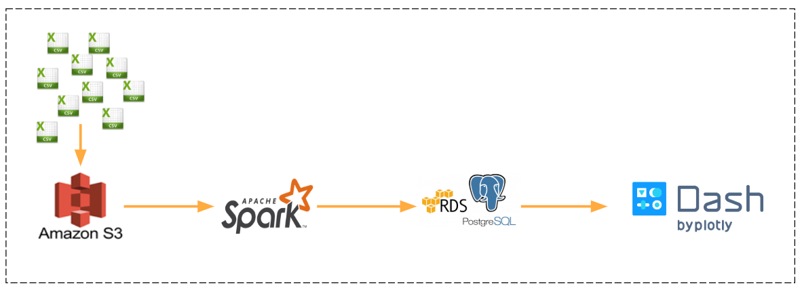

# BikeShare
##### This is a project I completed during the Insight Data Engineering program (Seattle, Winter 2020)
---
### Project type: 
Ingesting and joining of multiple large and diverse datasets

## Project ideas:
This project aims at analyzing the large amount of data sets collected from multiple sources to understand the trend of Bike Share usage in 10 different cities.

## Project goals:
* Ingested Bike Share data from 10 data sources for analyzing eco-friendly commute trend in 10 different cities
* Built an ETL pipeline by extracting the data from AWS S3, applying PySpark to transform and loading the output into AWS PostgreSQL
* Implemented Dash framework to create an analytical web application to query the data for user visualization

## Business use cases:
Analyzing the data sets to answer the questions:

* When do people use Bike Share?
  * How does usage change over the year, the month?
  
* Who are using Bike Share?
  * Members vs. casual users

From the analyzation, the bike share investors can make decisions about:

  * Should I invest more bikes for this city?
  
  * Should I invest this business model in a new city?

## Tech Stack

